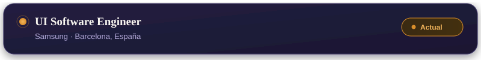
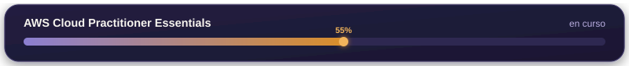
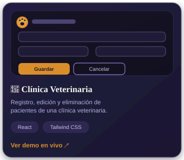
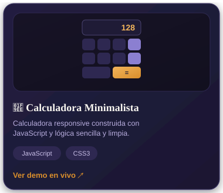
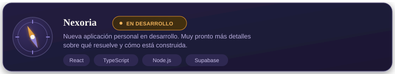

<!-- ========================================================= -->
<!--                         HERO                              -->
<!-- ========================================================= -->

  

  
  
  

  
  
  
  

 

Soy **UI Software Engineer** en **Samsung**, en Barcelona. Transformo ideas en productos digitales limpios, accesibles y mantenibles — cuidando tanto la experiencia de usuario como la calidad del código que hay detrás.

 

<!-- ========================================================= -->
<!--                      EXPERIENCIA                          -->
<!-- ========================================================= -->

## Experiencia

 

<strong>▸ Ver el detalle del rol</strong>

 

Desarrollo interfaces y soluciones frontend, participando en la construcción y evolución de productos digitales, con foco en:

- Interfaces de usuario y arquitectura de aplicaciones
- Experiencia de usuario y accesibilidad
- Calidad y mantenibilidad del código

 

 

<!-- ========================================================= -->
<!--                       PROYECTOS                           -->
<!-- ========================================================= -->

## Proyectos destacados

<table>
<tr>
<td width="50%" valign="top">

</td>
<td width="50%" valign="top">

</td>
</tr>
</table>

> 🔗 Demos en vivo: [Clínica Veterinaria](https://formularibasic.netlify.app/) · [Calculadora Minimalista](https://calculadoraop.netlify.app/)

 

 

<!-- ========================================================= -->
<!--                    STACK TECNOLÓGICO                      -->
<!-- ========================================================= -->

## Stack tecnológico

<strong>▸ Lenguajes y frameworks</strong>

 

<strong>▸ Bases de datos y herramientas</strong>

 

 

<!-- ========================================================= -->
<!--                       GITHUB                              -->
<!-- ========================================================= -->

## GitHub en vivo

  
  

  

<strong>▸ Actividad de contribuciones</strong>

 

  

 

<!-- ========================================================= -->
<!--                     CONTACTO                              -->
<!-- ========================================================= -->

  

  

  

© 2026 Sandra Rull Jariod · Built with curiosity & coffee

